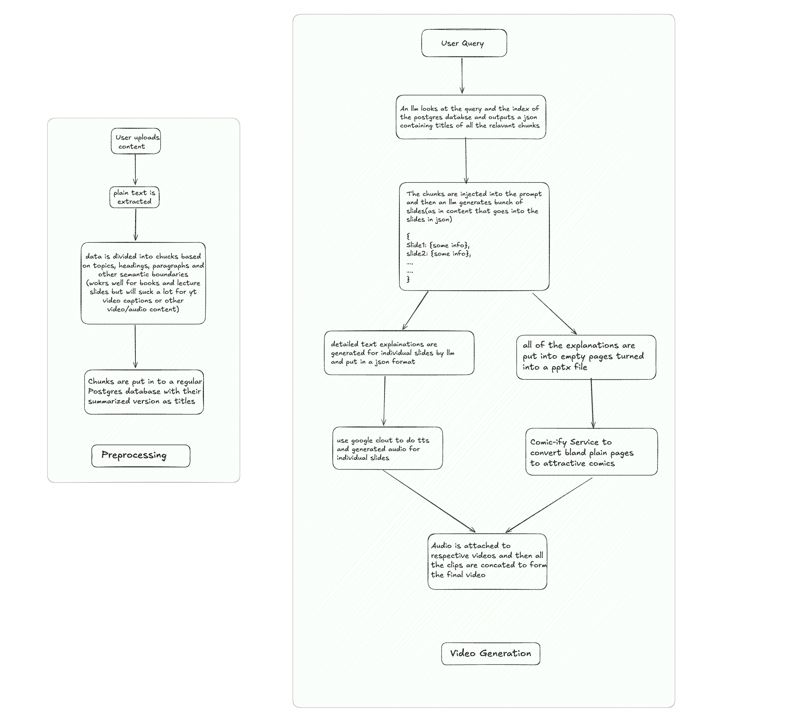
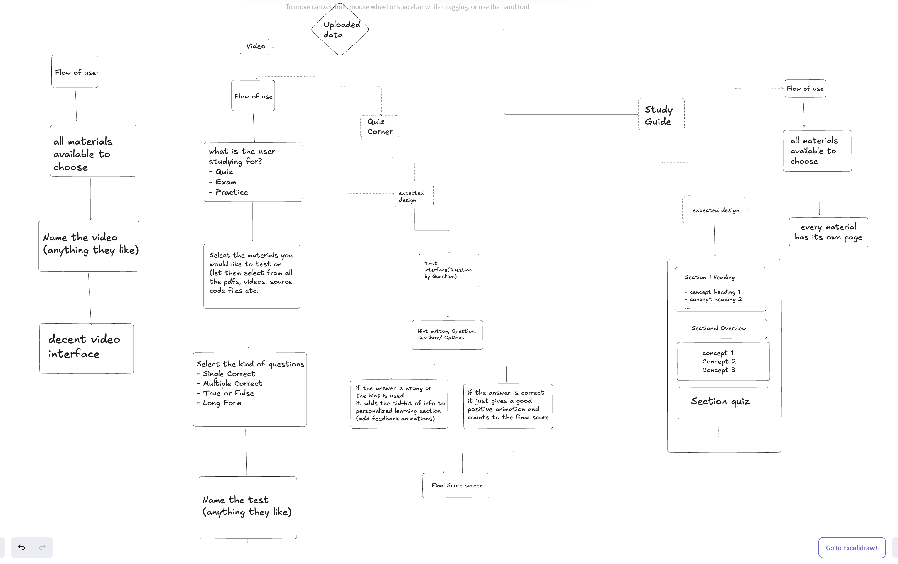

## Overview

Minerva is an AI-driven learning platform leveraging advanced RAG techniques and multi-modal processing to enable dynamic educational content generation and analysis. The system utilizes a distributed architecture with specialized AI agents for different computational tasks, backed by a robust data processing pipeline.

## Features

### Core Features

1. **Notebook Creation and Management**
    - Users can create and organize notebooks, uploading and managing a variety of materials such as:
        - PDF files
        - Picture(.jpeg, .png, .jpg, .svg, .gif)
        - Markdown/text/LaTeX/Source Code files
        - YouTube video links
        - Raw MP4/MP3 files
        - .docx, .pptx
        - .zip for bundled files
    - The system categorizes materials by topic and document type, storing them in a PostgreSQL database for efficient retrieval.
    - These notebooks can then be referenced to access common resources
2. **AI Agent Interaction**
    - Users interact with an AI **agents** capable of:
        - Querying the database to answer questions based on the user's materials.
        - Generating quizzes tailored to the user's knowledge and tracking performance.
        - Recommending areas of improvement and creating personalized learning roadmaps.
        - Crafting custom video lectures and generating flashcards for specific topics.
        - Providing answers to general subject-related queries.
        - Web search agent using serper api that can search and scrape the web just in case context is too limited to answer the users queries.
        - Generating diagrams that can summarize user uploaded content through mind maps or become roadmaps to help user learn new topics or allow user to create their own powerful visual mind maps. 
3. **Notebook Sharing**
    - Enable seamless sharing of notebooks with other users to foster collaboration and collective learning.
4. **Visualization Tools**
    - Create dynamic mind maps and learning roadmaps with the help of:
        - **MermaidJS** for interactive visualizations.
        - **PlantUML** for detailed diagrams.
        - **MarkMapJS*(https://markmap.js.org/repl)
        - **Excalidraw**(https://docs.excalidraw.com/docs/)
5. **Spaced Repetition for Flashcards**
    - Boost memorization efficiency by implementing AI-optimized intervals for flashcard reviews.
    - COMIC-ify* based

## Architecture

### System Architecture

The application comprises several components that work together to provide an intelligent and interactive learning experience:

- **Frontend**: ReactJS and NextJS
- **Backend**:
	- FastAPI/Python for AI stuff
	- Actix/rust crates for performance intensive video and data processing tasks
	- nodejs and expressjs/nestjs for excalidraw integration. 
	- Golang cause Priyanshu

- **Database**:
	- PostgreSQL for storing categorized learning materials
	- Redis for caching
	- RedisJSON for any random noSQL usecase
	- redis streams for Event Driven Queues
- **AI/ML Framework**: combination of different llms including but limited to gemini-2.0-flash(regular and thinking), gemini-1.5-pro, llama3.3(groq), deepseek-v3 depending on speed and task complexity
- **Visualization Tools**: Integration of Mermaid.js and PlantUML for rendering visual elements.

### High-Level Workflow

1. **Data Ingestion**
    - Users upload learning materials, which are categorized and stored in the PostgreSQL database.
2. **AI Interaction**
- **Question Answering Agent**: Provides concise and relevant responses to user queries.(based on the lightRAG or LazyRag Approach, probably have to implement the whole thing in rust cause raw python implementations are performance bottlenecks)
- **Quiz Generation Agent**: Designs customized quizzes based on user materials.
- **Slide/Video Generation Agent**: Generates slides or video lectures tailored to specific topics.(slides must be generated using COMIC-ify service)
- **Flashcard Creation Agent**: Produces flashcards optimized for memorization.(same use comic-ify service)
- **Roadmap Agent**: Creates personalized learning roadmaps and visually appealing mind maps.(must be created in three visual formats, MarkMap, excalidraw and mermaid)
- **Mindmap Agent**: Creates mindmaps based on uploaded notes/resources.(same as roadmap 3 visuals)
- **Research Agent**: An agent that can access the internet, any of the other agents can call this if they find their context lacking and ask for direction.(probably deepseek v3/ groq llama 3.3 and serper api)
3. **Subject Overview**
	- Detailed notes created from user uploaded contents(essentially users own notes but slightly more verbose and pretty eye candy 🤩!)
	- Sectional Revision points
	- Sectional Quiz
1. . **Collaboration and Sharing**
    - Shared notebooks enable multiple users to contribute and collaborate effectively.
2. **Visualization**
    - Mind maps and roadmaps are dynamically generated using Mermaid.js and PlantUML, providing a clear overview of topics and their relationships.

## Diagrams

## Development Plan

### Phase 1: Core Functionality

1. Build the notebook creation and material categorization system.
2. Build the LightRAG/LazyGraphRag prototype using existing implementation
3. Set up PostgreSQL database to store and manage user materials.
4. Develop AI agent functionality for querying and basic question answering using different RAG techniques.
5. Develop Sectional Overview
	- GraphQL for nested Query ({text, summary, quiz, more text ....})
6. Quiz should have basic single correct and multiple correct type questions 
7. Basic UI and Simple Animations
8. Internet access agent(serper api)
9. Deploy on vps using coolify or some other alternative

### Phase 2: Advanced Features

1.  User Auth
2. Optimize the RAG pipeline(+probably add neo4j if not already)
3. Implement advanced quiz generation and performance analysis.
	- the questions user gets wrong in review section or quiz section will be permanently stored for review
	- Users mistakes will appear in a separate analysis section for review and revision.
	- eye candy Stats page in analytics section
	- this data will then be given to other services like roadmap, flash cards, videos.
4. Implement slide and video generation with comicify so it looks crazy.(refer diagrams for details)
5. Develop visualization roadmaps and mind map tools using Mermaid.js, MarkMap, excalidraw etc.
6. Crazy smooth and slick Animations

### Phase 3: Enhancements

1. Add collaboration features for sharing notebooks.
### Phase 4: Dream

1. react native mobile and electron desktop apps or maybe swift ui?

## Roles and Responsibilities(tbd)

### Glossary

- **Notebook**: A digital collection of user-uploaded materials categorized by topic.
- **AI Agent**: An intelligent system that assists users by performing various tasks such as answering questions, creating quizzes, and generating personalized content.
- **Serper**: Best Google search api
- **Groq**: very fast and free llama3.3 endpoint based on LPUs
- **LPU**: fancy chips that run models very fast

## References

- [Vedanta Project](https://github.com/ishu-codes/vedanta/)
- [SIH Project](https://github.com/codebyyashvi/SIH)
- [COMIC-IFY](https://github.com/S0L009/COMIC-IFY_OneAPI)
- [YHack2024](https://github.com/kiriland/YHack2024)
- [ChatEdu](https://devpost.com/software/chatedu-0k4dgx)
- [Bark AI](https://github.com/suno-ai/bark.git)

